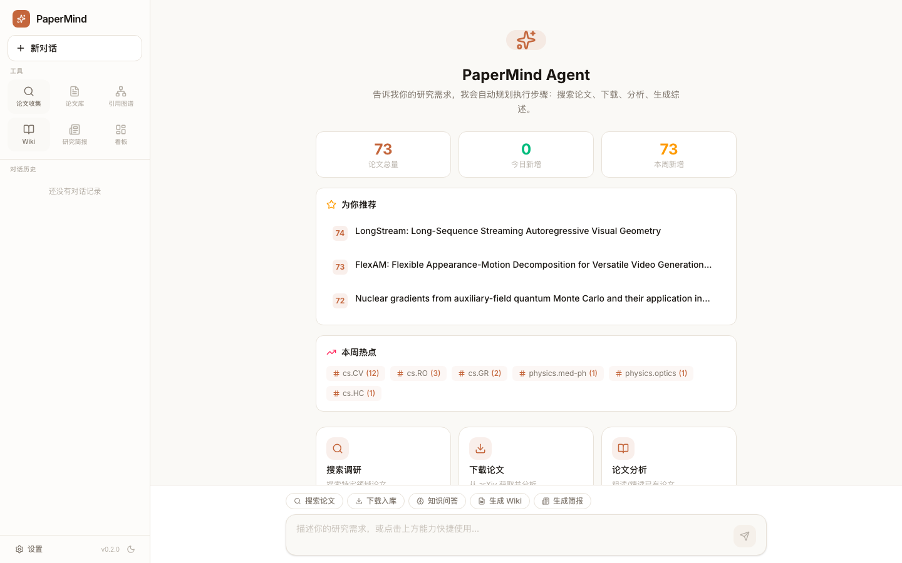
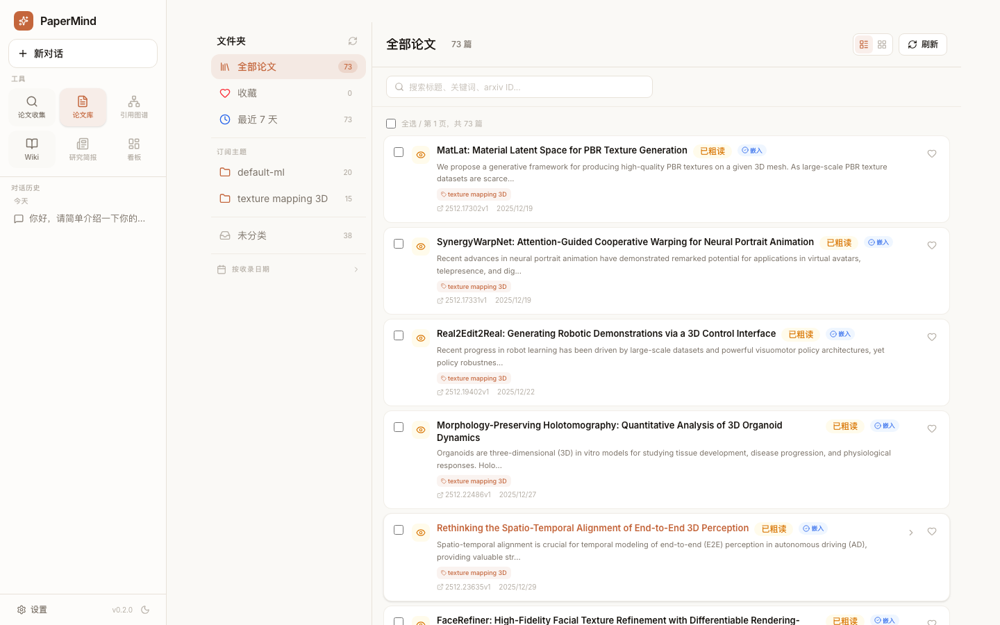
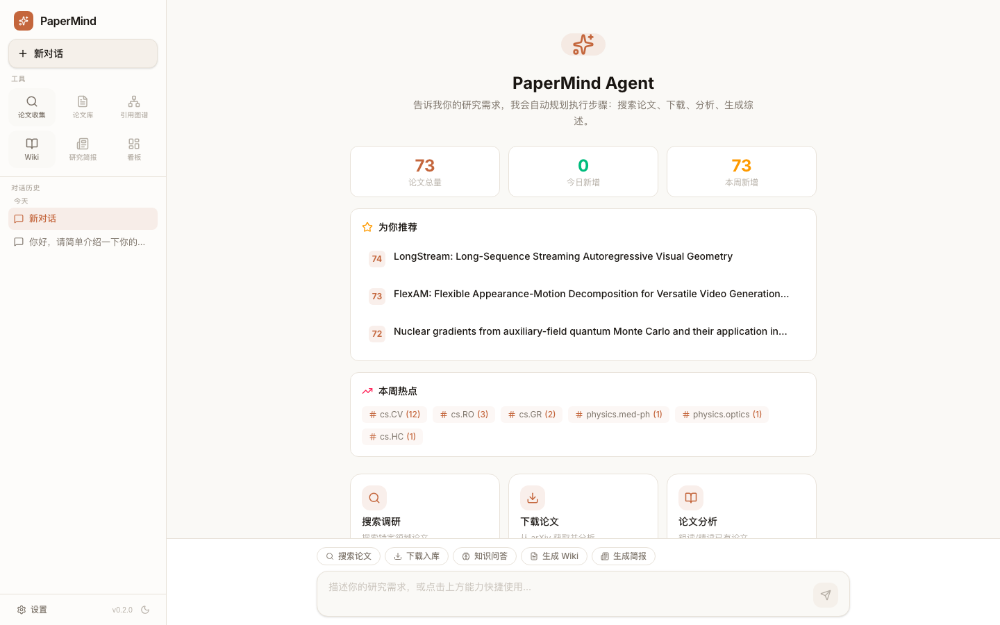
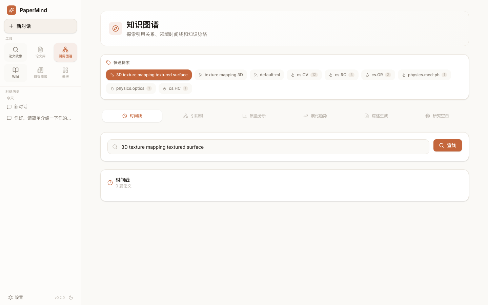
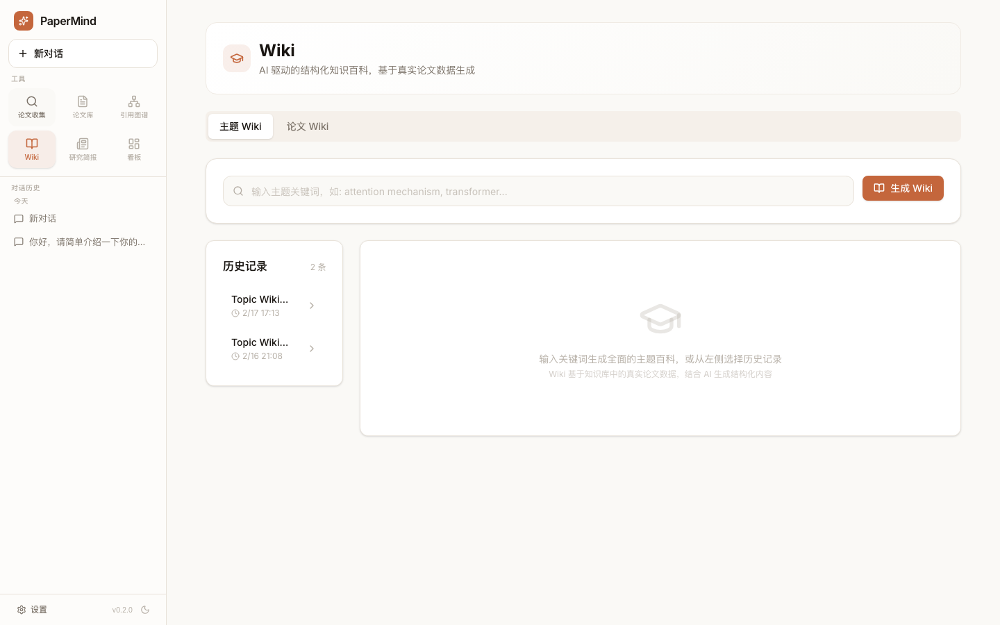
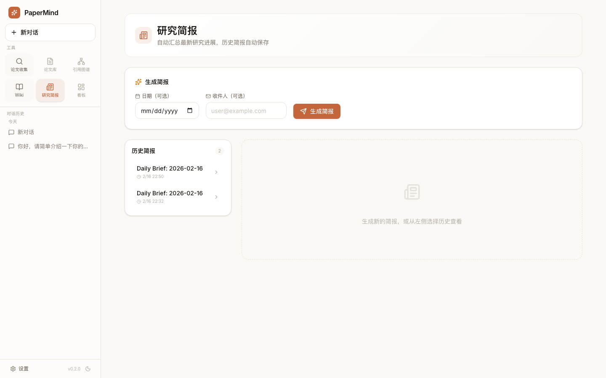
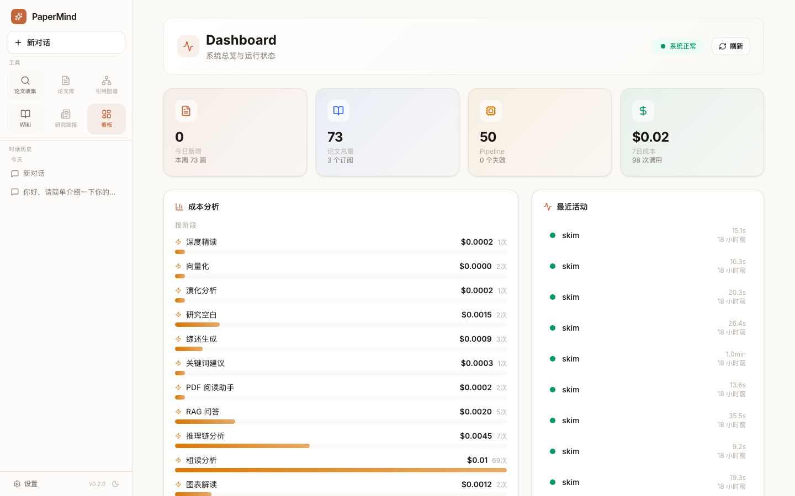
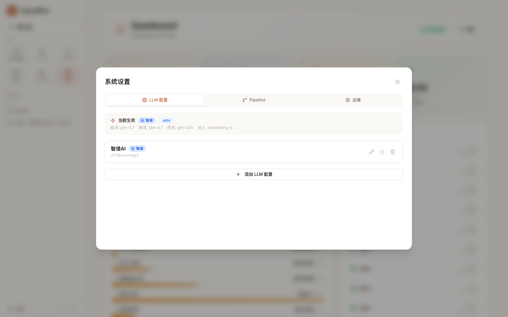
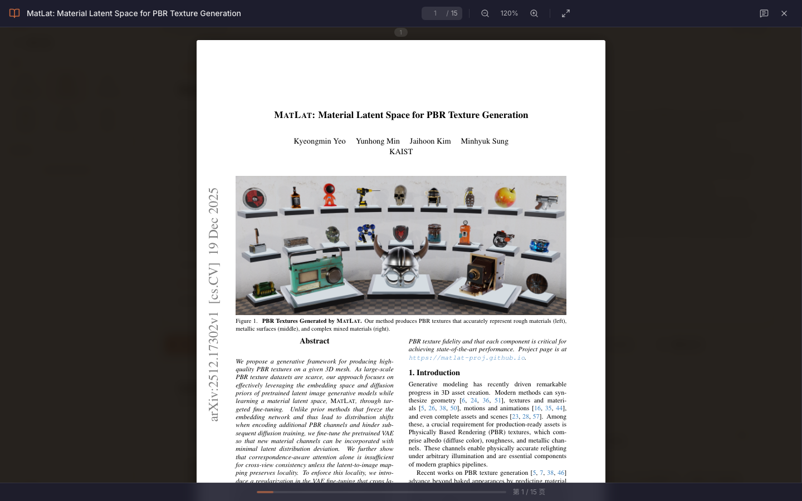

# ResearchOS

面向个人研究者和小团队的 AI 研究工作台：
- 论文收集与管理
- Agent 对话与工具调用
- 引用图谱与洞察
- Wiki / Brief / 写作辅助
- 项目工作流与任务追踪

## 界面预览

### 1) Agent 与论文工作台

| Agent | 论文列表 | 论文详情 |
|---|---|---|
|  |  |  |

### 2) 图谱 / Wiki / Brief

| 引用图谱 | Wiki | Daily Brief |
|---|---|---|
|  |  |  |

### 3) 项目与设置

| Dashboard | Settings | PDF 阅读 |
|---|---|---|
|  |  |  |

## 技术栈

- Backend: Python 3.11+, FastAPI, SQLAlchemy, Alembic
- Frontend: React 18, TypeScript, Vite
- Storage: SQLite（默认）
- Runtime: Docker Compose（推荐）

## 快速开始（Docker）

```bash
git clone https://github.com/keep-me/ResearchOS.git
cd ResearchOS

cp .env.example .env
# 至少配置一个可用的 LLM Key（OPENAI_API_KEY / ANTHROPIC_API_KEY / ZHIPU_API_KEY）

# 启动
docker compose up -d --build
```

访问地址：
- 前端: http://localhost:3002
- 后端: http://localhost:8002
- API 文档: http://localhost:8002/docs

## 常用命令

```bash
# 查看服务状态
docker compose ps

# 查看日志
docker compose logs -f backend
docker compose logs -f worker
docker compose logs -f frontend

# 重建
docker compose up -d --build

# 停止
docker compose down
```

## 环境变量（关键）

参考 `.env.example`，常用项：
- `SITE_URL`
- `CORS_ALLOW_ORIGINS`
- `DATABASE_URL`
- `OPENAI_API_KEY` / `ANTHROPIC_API_KEY` / `ZHIPU_API_KEY`
- `AUTH_PASSWORD` / `AUTH_SECRET_KEY`（开启站点登录时）

## 目录结构

- `apps/api`: FastAPI 入口与路由
- `apps/worker`: 后台任务 worker
- `packages`: 核心业务、模型、集成
- `frontend`: 前端应用
- `infra/migrations`: 数据库迁移
- `scripts`: 启动、测试、运维脚本
- `docs`: 项目文档

## 许可证

MIT
