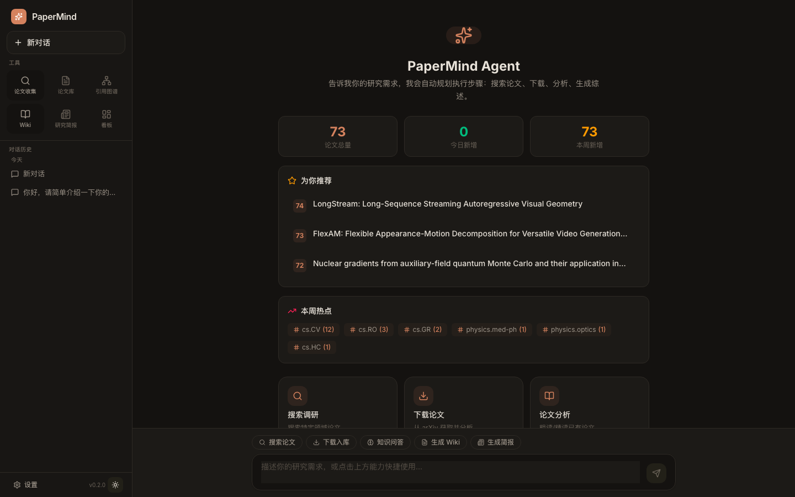

<div align="center">

<br/>


<br/><br/>

**AI 驱动的学术论文研究工作流平台**

*从「搜索论文」进化为「理解领域」*

<br/>

[](https://python.org)
[](https://fastapi.tiangolo.com)
[](https://react.dev)
[](https://typescriptlang.org)
[](https://tailwindcss.com)
[](https://sqlite.org)
[](LICENSE)
[](CHANGELOG)

<br/>


<br/><br/>

> 🚀 **让 AI 成为你的研究助理** —— 自动追踪、智能分析、知识图谱、学术写作，一站式搞定！

</div>

---

## 🚀 快速开始

### Docker 部署（生产推荐）

```bash
# 1️⃣ 克隆项目
git clone https://github.com/keep-me/ResearchOS.git && cd ResearchOS

# 2️⃣ 配置环境变量
cp .env.example .env
vim .env  # 编辑配置，至少填写 LLM API Key
# 如 Docker Hub 网络不稳定，可设置 BASE_REGISTRY=docker.m.daocloud.io

# 3️⃣ 一键部署
docker compose up -d --build

# 4️⃣ 访问服务
# 🌐 前端：http://localhost:3002
# 📡 后端 API: http://localhost:8002
# 📚 API 文档：http://localhost:8002/docs
```

### Docker 运维（重建与清理）

```bash
# 重建并启动（保留数据卷）
docker compose up -d --build

# 清理冗余构建缓存/旧镜像（不删除数据卷）
docker builder prune -af
docker image prune -af

# 查看空间占用
docker system df
```

### 本地开发

```bash
# 1️⃣ 克隆项目
git clone https://github.com/keep-me/ResearchOS.git && cd ResearchOS

# 2️⃣ 后端
python -m venv .venv && source .venv/bin/activate
pip install -e ".[llm,pdf]"
cp .env.example .env
vim .env  # 编辑 .env 填入 LLM API Key
python scripts/local_bootstrap.py  # 初始化数据库
uvicorn apps.api.main:app --reload --port 8000

# 3️⃣ 前端
cd frontend && npm install && npm run dev
# 🌐 打开 http://localhost:5173
```

详细启动与排障说明见 [docs/start-project.md](docs/start-project.md)。

### ARIS 回归检查

```powershell
# 完整 ARIS 回归：目标 pytest + 真实 smoke
pwsh -NoLogo -File scripts/run-aris-smoke.ps1

# 只跑目标 pytest
pwsh -NoLogo -File scripts/run-aris-smoke.ps1 -PytestOnly

# 只跑 end-to-end smoke
pwsh -NoLogo -File scripts/run-aris-smoke.ps1 -SmokeOnly

# 也可以直接走 npm 入口
npm run smoke:aris
npm run smoke:aris:quick
```

当前 smoke 覆盖：

- `sync_workspace`
- `monitor_experiment` 本地与远程
- `paper_compile`
- `paper_improvement`
- `run_experiment` 远程 batch `screen` 启动
- `run_experiment` 跨 run GPU lease 避让
- `paper_writing`
- `full_pipeline`

### 站点认证（可选）

```bash
# 在 .env 中设置密码即可启用
AUTH_PASSWORD=your_password_here
AUTH_SECRET_KEY=your_random_secret_key
```

---

## 🎯 这是什么？

ResearchOS 是一个**面向科研工作者的 AI 增强平台**，帮你：

| 😫 以前 | 😎 现在 |
|:--------|:--------|
| 每天手动刷 arXiv，怕错过重要论文 | 自动订阅主题，新论文推送到邮箱 |
| 读论文从摘要开始，不知道值不值得精读 | AI 粗读打分，快速筛选高价值论文 |
| 想了解领域发展，不知道从哪篇读起 | 知识图谱可视化，一眼看清引用脉络 |
| 写论文卡壳，不知道怎么表达 | 13 种写作工具，润色/翻译/去 AI 味 |
| 文献综述耗时耗力，整理几百篇头大 | Wiki 自动生成，一键产出领域综述 |

---

## ✨ 核心能力

<table>
<tr>
<td width="50%">

### 🤖 AI Agent 对话

你的智能研究助理，**自然语言交互**搞定一切：

- 💬 **SSE 流式对话** —— Claude 风格，实时响应
- 🔧 **22+ 工具链** —— 搜索/入库/分析/生成/写作自动调度
- ✅ **用户确认机制** —— 重要操作等你点头
- 📜 **对话历史持久化** —— 切页面不丢上下文
- 🎯 **AI 关键词建议** —— 描述研究方向 → 自动生成搜索词

</td>
<td width="50%">

### 📄 智能论文管理

从收录到精读，**全流程自动化**：

- 🔄 **ArXiv 增量抓取** —— 每个主题独立频率/时间
- 🚫 **论文去重检测** —— 避免重复处理浪费 token
- 📦 **递归抓取** —— 自动延伸更早期论文
- ⚡ **并行处理** —— 粗读/精读/嵌入三管齐下
- 💾 **按需下载 PDF** —— 入库不下载，精读才拉取

</td>
</tr>
<tr>
<td width="50%">

### 🔍 RAG 知识问答

向你的论文库**提问**，AI 跨论文综合分析：

- 🎯 **双路召回** —— 向量检索 + 全文检索
- 📚 **跨论文分析** —— 综合多篇论文回答问题
- 📝 **Artifact 卡片** —— 答案自动生成可复用内容
- 🔗 **引用追溯** —— 每句话都能找到出处

</td>
<td width="50%">

### 🕸️ 引用图谱

**可视化**你的研究领域：

- 🌳 **引用树** —— 单篇论文引用网络
- 🌐 **主题图谱** —— 跨主题引用关系
- 🌉 **桥接论文** —— 发现跨领域的核心工作
- 🔬 **研究前沿** —— 高被引 + 高引用的热点
- 📊 **研究空白** —— 发现 citation sparse region（含规则兜底，减少空结果）
- 🕘 **领域洞察历史** —— 自动保存每次洞察结果，可回看、可删除

</td>
</tr>
<tr>
<td width="50%">

### 📚 Wiki 自动生成

**一键生成**领域综述：

- 📖 **主题 Wiki** —— 输入关键词，输出完整综述
- 📄 **论文 Wiki** —— 单篇论文深度解读
- 📊 **实时进度条** —— 异步生成，自动刷新
- 📜 **历史回溯** —— 所有生成内容可查看

</td>
<td width="50%">

### ✍️ 学术写作助手

**13 种写作工具**，来自顶尖研究机构：

- 🌏 **中转英 / 英转中** —— 学术级翻译
- ✨ **润色（中/英）** —— 更地道的学术表达
- 🤖 **去 AI 味** —— 降低 AI 检测率
- 📊 **图表推荐 / 标题生成** —— 实验数据可视化建议
- 🧪 **Reviewer 视角** —— 模拟审稿人批评

</td>
</tr>
<tr>
<td width="50%">

### 📖 沉浸式 PDF 阅读器

**专注阅读**，AI 随叫随到：

- 📜 **连续滚动** —— IntersectionObserver 页码追踪
- 🔍 **缩放/全屏/跳转** —— 键盘快捷键支持
- 🌐 **arXiv 在线代理** —— 无本地 PDF 也能读
- ✨ **选中即问** —— AI 解释/翻译/总结
- 📝 **侧边 AI 栏** —— Markdown + LaTeX 渲染

</td>
<td width="50%">

### 🔐 站点安全认证

**保护你的研究资产**：

- 🔑 **站点密码** —— 简单可靠，适合个人/小团队
- 🎫 **JWT Token** —— 7 天有效期，自动续期
- 🛡️ **全站保护** —— 所有 API 都需要认证
- 📄 **PDF Token** —— 文件访问也安全

</td>
</tr>
</table>

---

## 📸 界面预览

<table>
<tr>
<td align="center" width="50%">
<strong>🤖 AI Agent 对话主页</strong><br/><br/>

<br/><sub>智能对话 · 论文推荐 · 热点追踪</sub>
</td>
<td align="center" width="50%">
<strong>📄 论文库管理</strong><br/><br/>

<br/><sub>主题分类 · 日期分组 · 批量操作</sub>
</td>
</tr>
<tr>
<td align="center" width="50%">
<strong>📖 沉浸式 PDF 阅读器</strong><br/><br/>

<br/><sub>连续滚动 · AI 问答 · arXiv 代理</sub>
</td>
<td align="center" width="50%">
<strong>🕸️ 知识图谱</strong><br/><br/>

<br/><sub>引用树 · 研究前沿 · 共引聚类</sub>
</td>
</tr>
<tr>
<td align="center" width="50%">
<strong>📚 Wiki 自动生成</strong><br/><br/>

<br/><sub>主题综述 · 论文解读 · 历史回溯</sub>
</td>
<td align="center" width="50%">
<strong>🌙 暗色主题</strong><br/><br/>

<br/><sub>全局暗色 · 护眼阅读</sub>
</td>
</tr>
</table>

---

## 🏗️ 架构总览

```
┌─────────────────────────────────────────────────────────────┐
│                     Frontend (React 18)                      │
│  Agent │ Papers │ Wiki │ Graph │ Brief │ Collect │ Writing  │
│         路由懒加载 · Vite 代码分割 · SSE 跨页保活            │
└─────────────────────────┬───────────────────────────────────┘
                          │ REST + SSE (JWT Auth)
┌─────────────────────────┴───────────────────────────────────┐
│                      FastAPI Backend                         │
├─────────────┬─────────────┬─────────────┬───────────────────┤
│   Agent     │   Pipeline  │    RAG      │  Graph / Wiki /   │
│   Service   │   Engine    │   Service   │  Brief / Write    │
├─────────────┴─────────────┴─────────────┴───────────────────┤
│         Global TaskTracker (异步任务 + 实时进度)             │
├─────────────────────────────────────────────────────────────┤
│           Unified LLM Client (连接复用 + TTL 缓存)           │
│            OpenAI  │  Anthropic  │  ZhipuAI                 │
├─────────────────────────────────────────────────────────────┤
│   SQLite (WAL)  │  ArXiv API  │  Semantic Scholar API       │
└─────────────────────────────────────────────────────────────┘
                           │
              ┌────────────┴────────────┐
              │   APScheduler Worker    │
              │   按主题独立调度         │
              │   每日简报 / 每周图谱    │
              └─────────────────────────┘
```
---
## ⚙️ 环境变量

| 变量 | 说明 | 默认值 |
|:-----|:-----|:------:|
| `LLM_PROVIDER` | LLM 提供商 (openai/anthropic/zhipu) | `zhipu` |
| `ZHIPU_API_KEY` | 智谱 API Key | — |
| `LLM_MODEL_SKIM` | 粗读模型 | `glm-4.7` |
| `LLM_MODEL_DEEP` | 精读模型 | `glm-4.7` |
| `LLM_MODEL_VISION` | 视觉模型 | `glm-4.6v` |
| `SITE_URL` | 生产域名 | `http://localhost:5173` |
| `AUTH_PASSWORD` | 站点密码（留空禁用认证） | — |
| `AUTH_SECRET_KEY` | JWT 密钥 | — |
| `COST_GUARD_ENABLED` | 成本守卫 | `true` |
| `DAILY_BUDGET_USD` | 每日预算 | `2.0` |

> 完整配置见 `.env.example`

---

## 📡 API 速览

<details>
<summary><strong>🔐 认证</strong></summary>

| 方法 | 路径 | 说明 |
|:----:|:-----|:-----|
| POST | `/auth/login` | 登录获取 JWT Token |
| GET | `/auth/status` | 查询认证状态 |

</details>

<details>
<summary><strong>🤖 AI Agent</strong></summary>

| 方法 | 路径 | 说明 |
|:----:|:-----|:-----|
| POST | `/agent/chat` | Agent 对话（SSE 流式） |
| POST | `/agent/confirm/{id}` | 确认工具执行 |
| POST | `/agent/reject/{id}` | 拒绝工具执行 |

</details>

<details>
<summary><strong>📄 论文管理</strong></summary>

| 方法 | 路径 | 说明 |
|:----:|:-----|:-----|
| GET | `/papers/latest` | 论文列表（分页） |
| GET | `/papers/{id}` | 论文详情 |
| GET | `/papers/{id}/pdf` | PDF 文件流 |
| POST | `/pipelines/skim/{id}` | 粗读 |
| POST | `/pipelines/deep/{id}` | 精读 |

</details>

<details>
<summary><strong>🕸️ 知识图谱</strong></summary>

| 方法 | 路径 | 说明 |
|:----:|:-----|:-----|
| GET | `/graph/citation-tree/{id}` | 引文树 |
| GET | `/graph/overview` | 全局概览 |
| GET | `/graph/bridges` | 桥接论文 |
| GET | `/graph/frontier` | 研究前沿 |

</details>

---

## ⚡ 性能优化

| 类别 | 优化策略 |
|------|----------|
| **前端** | 路由懒加载 · `useMemo`/`useCallback` · Vite chunk 分割 |
| **SSE** | RAF 批量 flush · 跨页面保活 |
| **LLM** | 连接复用 · 30s TTL 缓存 · 120s 超时 |
| **数据库** | SQLite WAL · 64MB cache · 关键索引 |
| **论文处理** | embed ∥ skim 并行 · 3 篇同时处理 |
| **成本** | 去重检测 · 全链路 token 追踪 |

---

## 📋 更新日志

### v3.1 (2026-03-01) — 安全认证 + 稳定性增强

**新功能**
- 🔐 **站点密码认证** —— JWT Token 保护所有 API，适合公开部署
- 📄 **PDF Token 认证** —— 支持 query param token，文件访问也安全
- 🔄 **SSE 认证** —— Agent 对话等 SSE 请求携带认证

**Bug 修复**
- 修复 `getApiBase()` 缺失闭合导致 TypeScript 编译失败
- 恢复 `GZipMiddleware` 响应压缩
- 恢复 `logging_setup` 统一日志格式

### v3.0 (2026-02-28) — 稳定性全面升级

**新功能**
- Agent 对话历史完整持久化
- PDF arXiv 在线代理
- 论文去重检测
- 全局任务追踪系统

**Bug 修复**
- 修复 Wiki 生成失败、Agent 对话历史报错等 12+ 问题
- 修复 nginx 配置导致的前端容器 crash
- 修复 Semantic Scholar API 限速重试

<details>
<summary><strong>查看历史版本</strong></summary>

### v2.8 — 后端重构 + Agent 智能化
### v2.7 — 多源引用 + 相似度地图
### v2.5 — 知识图谱可视化
### v2.0 — Agent 对话系统
### v1.0 — 基础论文管理

</details>

---

## 🔧 开发

```bash
# 后端 lint
python -m ruff check .

# 前端类型检查
cd frontend && npx tsc --noEmit

# 数据库迁移
cd infra && alembic revision --autogenerate -m "描述"
alembic upgrade head
```

目录说明见 [docs/project-layout.md](docs/project-layout.md)。

---

## 🙏 致谢

- **[awesome-ai-research-writing](https://github.com/Leey21/awesome-ai-research-writing)** — 写作助手 Prompt 模板来源
- **[ArXiv](https://arxiv.org)** — 开放论文平台
- **[Semantic Scholar](https://www.semanticscholar.org)** — 引用数据来源

---

## 📄 License

[MIT](LICENSE)

---

<div align="center">

**Maintained by [keep-me](https://github.com/keep-me)**

*ResearchOS — 让 AI 帮你读论文，让知识触手可及。*

[](https://github.com/keep-me/ResearchOS/stargazers)

</div>
