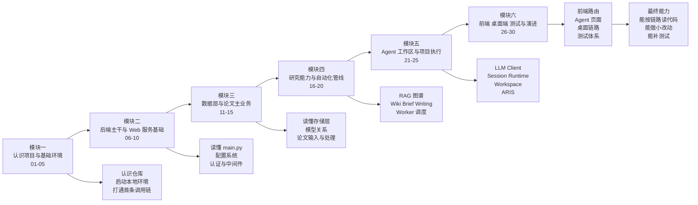

# 01 学习路线总图

## 覆盖模块

- `class/lesson-01-overview.md` 到 `class/lesson-30-testing-and-roadmap.md`
- `class/ResearchOS-30课课程总纲.md`

## 图

## 阅读提示

- 这张图回答的是“先学什么，后学什么”。
- 真正的依赖关系看下一张 `02`，这张更强调学习顺序和阶段目标。
