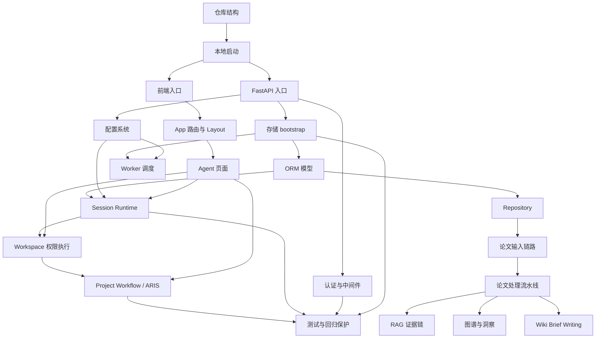

# 02 知识依赖图

## 覆盖模块

- `apps/api/main.py`
- `packages/config.py`
- `packages/storage/bootstrap.py`
- `packages/storage/models.py`
- `packages/storage/paper_repository.py`
- `packages/ai/paper/pipelines.py`
- `packages/ai/research/rag_service.py`
- `packages/agent/session/session_runtime.py`
- `packages/agent/workspace/workspace_executor.py`
- `packages/ai/project/workflow_runner.py`
- `frontend/src/App.tsx`
- `frontend/src/pages/Agent.tsx`

## 图

## 阅读提示

- 这张图回答的是“哪些知识必须先学，哪些知识是后续叠加出来的”。
- `配置 -> 存储 -> session/workspace` 是整个仓库最强的一条基础依赖链。
