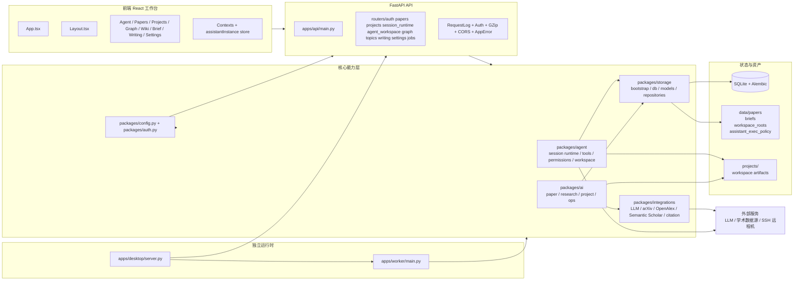

# 03 项目总架构图

## 覆盖模块

- `frontend/src/App.tsx`
- `frontend/src/components/Layout.tsx`
- `apps/api/main.py`
- `apps/api/routers/`
- `packages/agent/`
- `packages/ai/`
- `packages/storage/`
- `packages/integrations/`
- `apps/worker/main.py`
- `apps/desktop/server.py`

## 图

## 阅读提示

- 这是“全局静态架构图”，回答系统由哪些层组成。
- 真正的动态行为请继续看 `05`、`06`、`08`、`09`、`10`。
