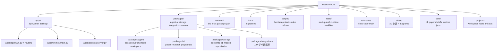

# 04 仓库结构图

## 覆盖模块

- 仓库根目录
- `apps/`
- `packages/`
- `frontend/`
- `infra/`
- `scripts/`
- `tests/`
- `reference/`
- `class/`

## 图

## 阅读提示

- 学习时优先顺序通常是 `apps -> packages -> frontend -> tests -> scripts`。
- `reference/` 用来做对照，不参与当前仓库运行事实。
