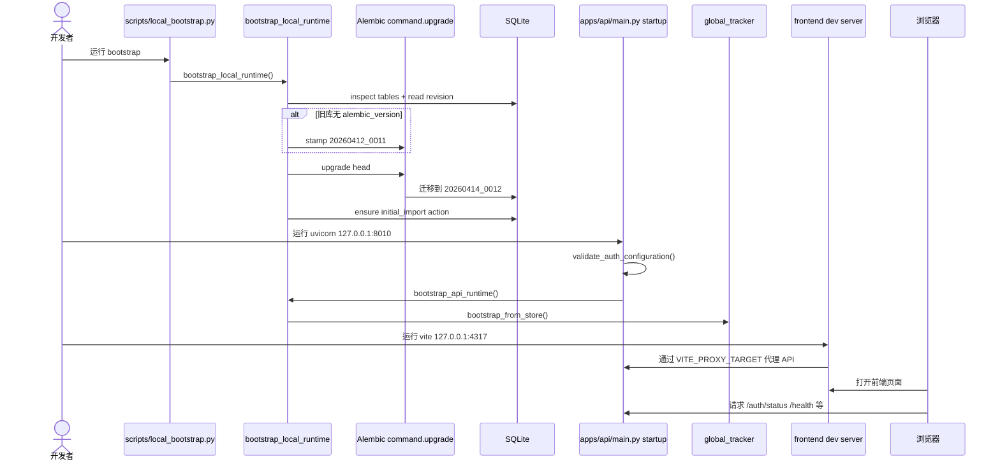

# 05 本地启动时序图

## 覆盖模块

- `scripts/local_bootstrap.py`
- `packages/storage/bootstrap.py`
- `scripts/start_api_dev.ps1`
- `apps/api/main.py`
- `scripts/start_frontend_dev.ps1`
- `frontend/package.json`

## 图

## 阅读提示

- 这里最重要的认知是“显式 bootstrap”和“API startup bootstrap”是两层防线。
- 端口来自脚本，不要靠记忆猜。
