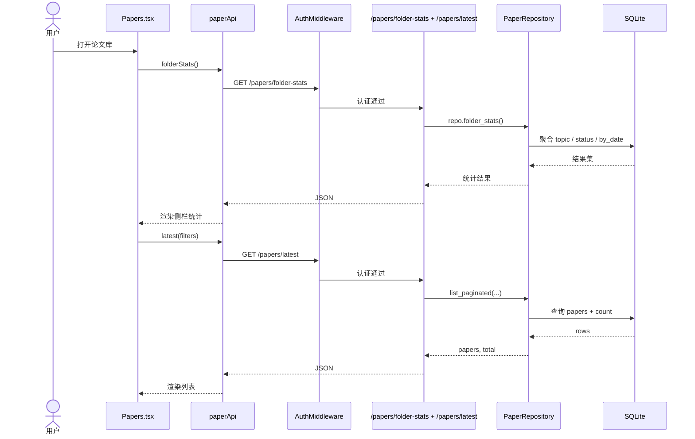

# 06 第一条前后端调用链时序图

## 覆盖模块

- `frontend/src/pages/Papers.tsx`
- `frontend/src/services/api.ts`
- `apps/api/main.py`
- `apps/api/routers/papers.py`
- `packages/storage/db.py`
- `packages/storage/paper_repository.py`

## 图

## 阅读提示

- 这条链路适合作为第一次“页面 -> 服务 -> 路由 -> repository -> 数据库”的完整练习。
- 如果要看上传链路，请直接看 `08` 和 `14`。
