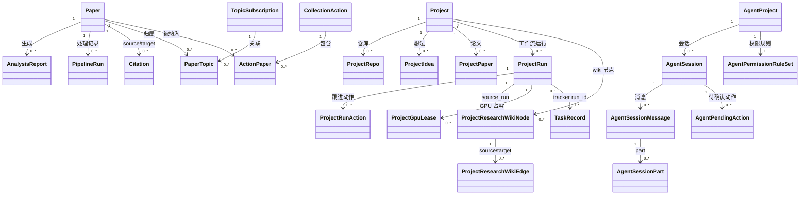

# 07 核心数据模型关系图

## 覆盖模块

- `packages/storage/models.py`

## 图

```mermaid
classDiagram
  class Paper
  class AnalysisReport
  class Citation
  class PipelineRun
  class TopicSubscription
  class PaperTopic
  class CollectionAction
  class ActionPaper
  class Project
  class ProjectRepo
  class ProjectIdea
  class ProjectPaper
  class ProjectRun
  class ProjectRunAction
  class ProjectResearchWikiNode
  class ProjectResearchWikiEdge
  class AgentProject
  class AgentSession
  class AgentSessionMessage
  class AgentSessionPart
  class AgentPendingAction
  class AgentPermissionRuleSet
  class TaskRecord
  class ProjectGpuLease

  Paper "1" --> "0..*" AnalysisReport : 生成
  Paper "1" --> "0..*" PipelineRun : 处理记录
  Paper "1" --> "0..*" Citation : source/target
  Paper "1" --> "0..*" PaperTopic : 归属
  TopicSubscription "1" --> "0..*" PaperTopic : 关联
  CollectionAction "1" --> "0..*" ActionPaper : 包含
  Paper "1" --> "0..*" ActionPaper : 被纳入

  Project "1" --> "0..*" ProjectRepo : 仓库
  Project "1" --> "0..*" ProjectIdea : 想法
  Project "1" --> "0..*" ProjectPaper : 论文
  Project "1" --> "0..*" ProjectRun : 工作流运行
  ProjectRun "1" --> "0..*" ProjectRunAction : 跟进动作
  Project "1" --> "0..*" ProjectResearchWikiNode : wiki 节点
  ProjectResearchWikiNode "1" --> "0..*" ProjectResearchWikiEdge : source/target
  ProjectRun "1" --> "0..*" ProjectResearchWikiNode : source_run
  ProjectRun "1" --> "0..*" ProjectGpuLease : GPU 占用

  AgentProject "1" --> "0..*" AgentSession : 会话
  AgentSession "1" --> "0..*" AgentSessionMessage : 消息
  AgentSessionMessage "1" --> "0..*" AgentSessionPart : part
  AgentSession "1" --> "0..*" AgentPendingAction : 待确认动作
  AgentProject "1" --> "1" AgentPermissionRuleSet : 权限规则
  ProjectRun "0..1" --> "0..*" TaskRecord : tracker run_id
```

## 阅读提示

- 这张图只画“一级对象和主关系”，不展开所有字段。
- 真正读模型时要重点盯 `Project*`、`Agent*`、`Paper*` 三大簇。
