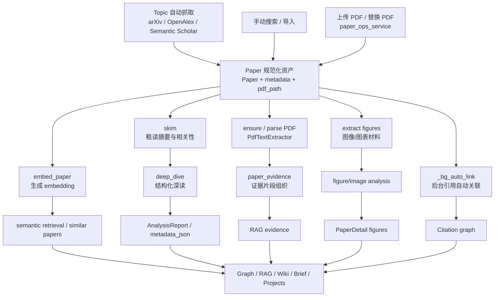

# 08 论文处理流水线图

## 覆盖模块

- `packages/ai/paper/paper_ops_service.py`
- `packages/ai/paper/pipelines.py`
- `packages/ai/paper/pdf_parser.py`
- `packages/ai/paper/paper_analysis_service.py`
- `packages/ai/paper/paper_evidence.py`
- `apps/api/routers/papers.py`
- `packages/storage/paper_repository.py`

## 图

## 阅读提示

- 当前代码已经把“文件接收与落盘”和“后续分析流水线”分开了。
- `paper_ops_service.py` 负责把 paper 资产规范化，`pipelines.py` 负责继续加工。
