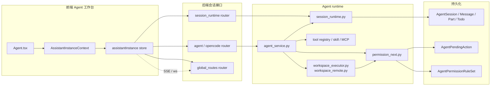

# 09 Agent Runtime 关系图

## 覆盖模块

- `frontend/src/contexts/AssistantInstanceContext.tsx`
- `frontend/src/features/assistantInstance/store.ts`
- `frontend/src/pages/Agent.tsx`
- `apps/api/routers/session_runtime.py`
- `apps/api/routers/agent.py`
- `apps/api/routers/opencode.py`
- `packages/agent/runtime/agent_service.py`
- `packages/agent/runtime/permission_next.py`
- `packages/agent/session/session_runtime.py`
- `packages/agent/workspace/workspace_executor.py`

## 图

## 阅读提示

- 这张图回答的是“Agent 页面背后到底连着哪些后端运行时模块”。
- 如果你在读会话、权限、工作区三者边界，这张图最有用。
