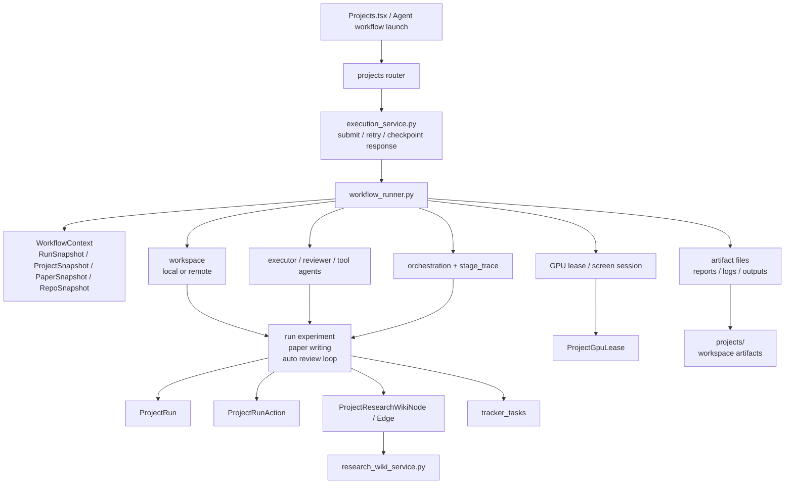

# 10 Project Workflow 与 ARIS 编排图

## 覆盖模块

- `apps/api/routers/projects.py`
- `packages/ai/project/execution_service.py`
- `packages/ai/project/workflow_runner.py`
- `packages/ai/project/workflow_catalog.py`
- `packages/storage/models.py`
- `packages/ai/research/research_wiki_service.py`

## 图

## 阅读提示

- `workflow_runner.py` 复杂不是偶然，而是因为它真的在做执行系统编排。
- `ProjectResearchWikiNode/Edge` 说明结果不只是日志，而是在资产化。
