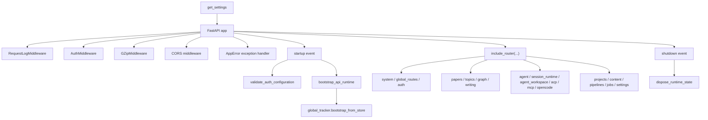

# 11 FastAPI 入口装配图

## 覆盖模块

- `apps/api/main.py`
- `apps/api/routers/__init__.py`
- `packages/auth.py`
- `packages/storage/bootstrap.py`

## 图

## 阅读提示

- 这张图回答的是“`main.py` 虽然短，但到底装配了哪些东西”。
- 近期变更最关键的是 startup 先校验认证配置，再 bootstrap runtime。
