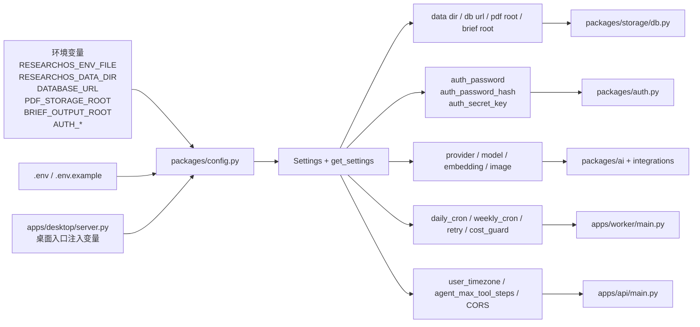

# 12 配置系统解析图

## 覆盖模块

- `packages/config.py`
- `.env.example`
- `apps/desktop/server.py`
- `packages/auth.py`
- `packages/storage/db.py`

## 图

## 阅读提示

- 当前仓库里，`Settings` 类而不是 `.env.example` 才是配置真相的最终解释器。
- `get_settings()` 还会顺手准备目录，不只是纯读取。
