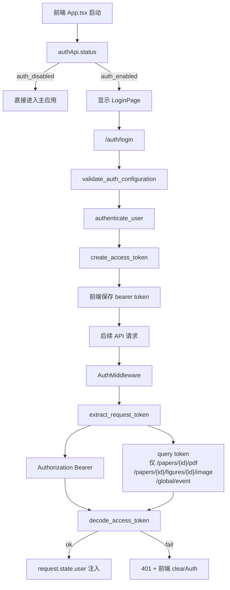

# 13 认证流程图

## 覆盖模块

- `packages/auth.py`
- `apps/api/main.py`
- `apps/api/routers/auth.py`
- `frontend/src/App.tsx`
- `frontend/src/services/api.ts`
- `tests/test_auth_security.py`

## 图

## 阅读提示

- 当前认证的关键不是“有没有登录页”，而是“启动和请求阶段都在做配置与 token 校验”。
- `tests/test_auth_security.py` 是这张图最好的回归锚点。
