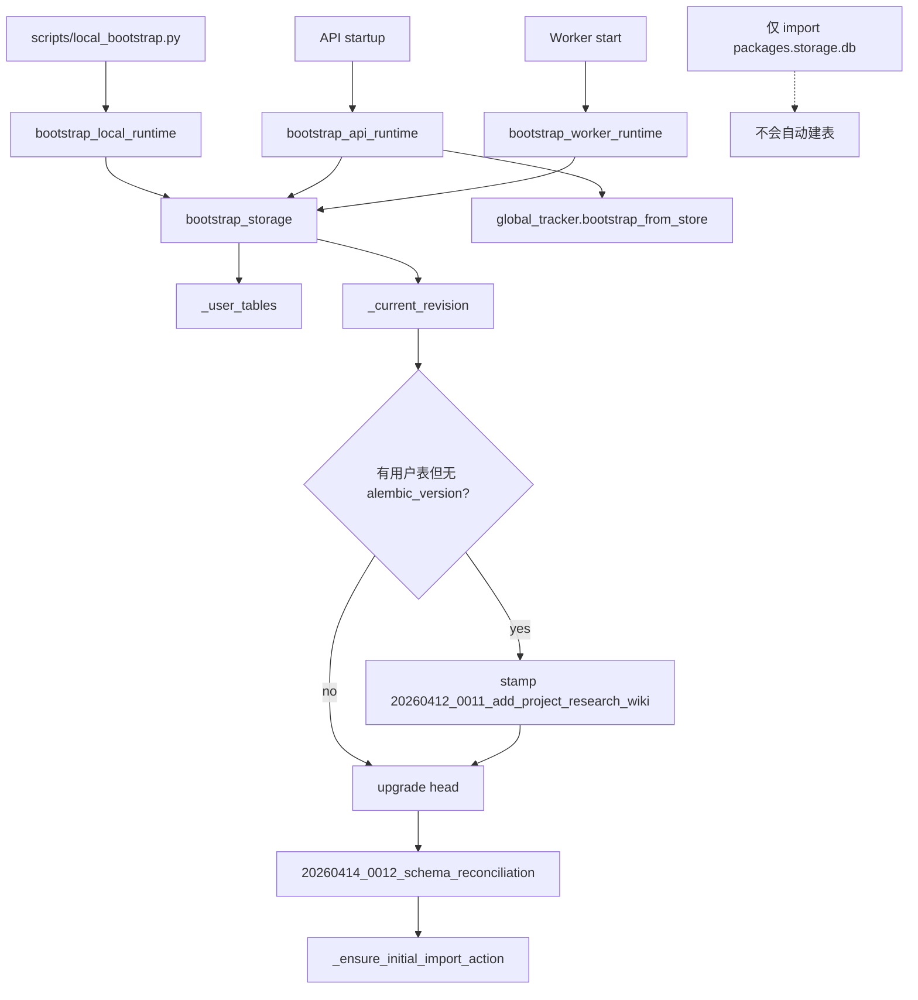

# 14 存储 Bootstrap 图

## 覆盖模块

- `packages/storage/bootstrap.py`
- `packages/storage/db.py`
- `tests/test_storage_bootstrap.py`
- `scripts/local_bootstrap.py`
- `apps/api/main.py`
- `apps/worker/main.py`

## 图

## 阅读提示

- 这张图回答的是“为什么现在必须显式 bootstrap，而不是导入 ORM 就算完成”。
- `tests/test_storage_bootstrap.py` 基本把整条链路的关键点都锁住了。
