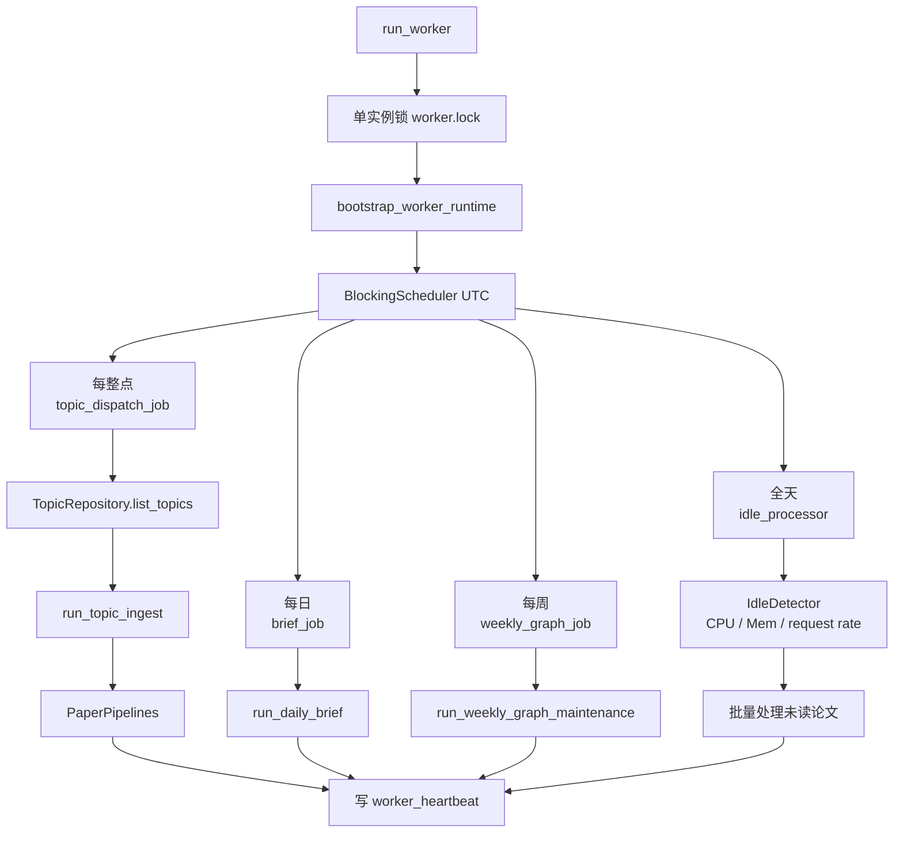

# 15 Worker 调度时间线

## 覆盖模块

- `apps/worker/main.py`
- `packages/ai/ops/daily_runner.py`
- `packages/ai/ops/idle_processor.py`
- `packages/storage/bootstrap.py`

## 图

## 阅读提示

- Worker 不是只有“定时任务”，还有单实例锁、心跳、重试和闲时处理。
- 如果你在追“为什么某些论文会被自动处理”，从这张图入手最快。
