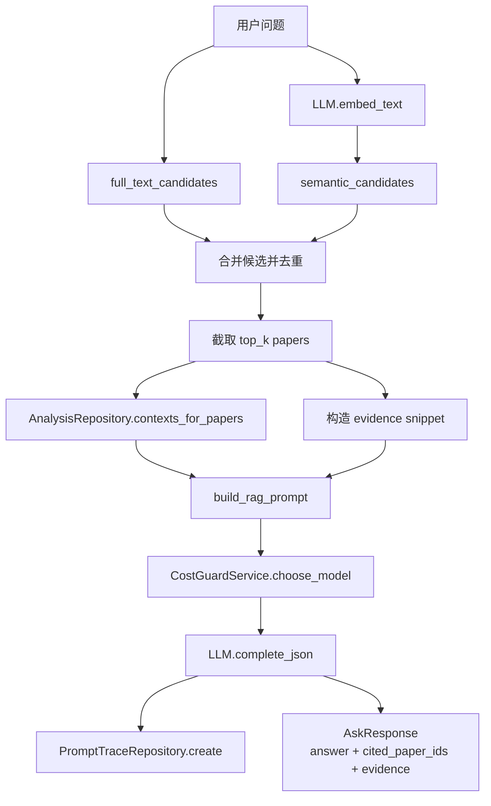

# 16 RAG 证据链图

## 覆盖模块

- `packages/ai/research/rag_service.py`
- `packages/storage/paper_repository.py`
- `packages/storage/repositories.py`
- `packages/ai/research/cost_guard.py`
- `packages/integrations/llm_client.py`

## 图

## 阅读提示

- 这张图里的重点不是“检索”本身，而是“证据怎么被拼到回答里”。
- `semantic_candidates()` 最近修过一次候选排序回归，读这张图时可以顺手看相关测试。
