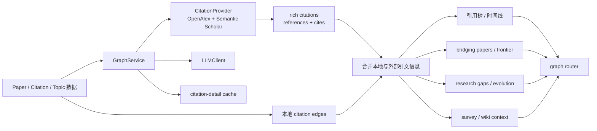

# 17 图谱洞察图

## 覆盖模块

- `packages/ai/research/graph_service.py`
- `packages/integrations/citation_provider.py`
- `packages/integrations/semantic_scholar_client.py`
- `packages/storage/repositories.py`
- `apps/api/routers/graph.py`

## 图

## 阅读提示

- 图谱能力不是“把论文连起来就完了”，它还要拼本地数据、外部引文源和 LLM 分析。
- `GraphService` 本质上是“检索 + 关系整理 + 解释生成”的混合层。
