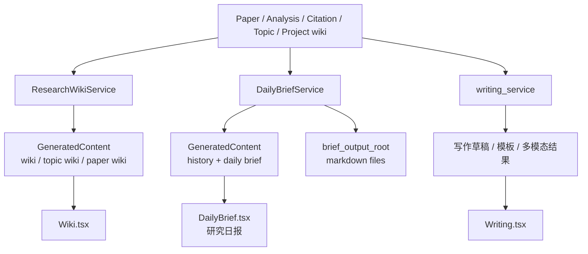

# 18 Wiki / Brief / Writing 产出链图

## 覆盖模块

- `packages/ai/research/research_wiki_service.py`
- `packages/ai/research/brief_service.py`
- `packages/ai/research/writing_service.py`
- `packages/storage/models.py`
- `frontend/src/pages/Wiki.tsx`
- `frontend/src/pages/DailyBrief.tsx`
- `frontend/src/pages/Writing.tsx`

## 图

## 阅读提示

- 这张图回答的是“论文分析结果怎样继续转化成可消费的知识产品”。
- `ProjectResearchWikiNode/Edge` 会把 Project Workflow 的结果继续喂给 wiki 链路。
