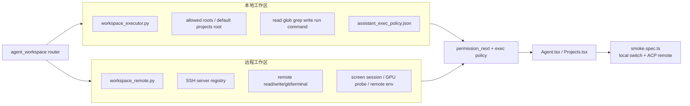

# 19 本地与远程工作区对照图

## 覆盖模块

- `packages/agent/workspace/workspace_executor.py`
- `packages/agent/workspace/workspace_remote.py`
- `packages/agent/workspace/workspace_server_registry.py`
- `apps/api/routers/agent_workspace.py`
- `frontend/tests/smoke.spec.ts`

## 图

## 阅读提示

- 本地和远程不是两套完全独立产品面，而是共享同一组前端入口与权限框架。
- 真正的差异主要在传输层、环境准备和远程设备管理。
