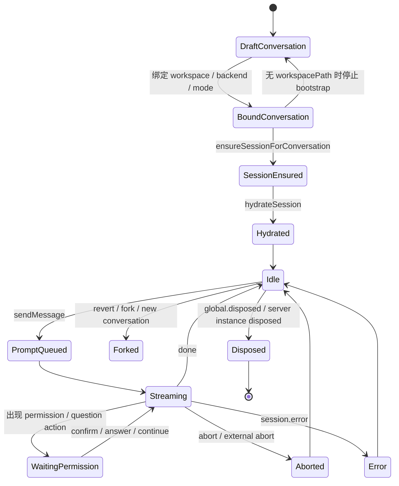

# 20 Session Runtime 状态机

## 覆盖模块

- `packages/agent/session/session_runtime.py`
- `packages/agent/runtime/agent_service.py`
- `frontend/src/features/assistantInstance/store.ts`
- `packages/storage/models.py`

## 图

## 阅读提示

- 前端 store 和后端 runtime 一起决定了这个状态机，不是单边逻辑。
- 最近的变更点是“没有 workspacePath 就不自动推进到 SessionEnsured”。
