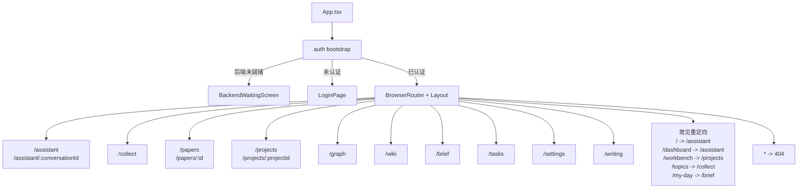

# 21 App.tsx 路由图

## 覆盖模块

- `frontend/src/App.tsx`
- `frontend/src/components/Layout.tsx`
- `frontend/src/components/shell/navigation.ts`

## 图

## 阅读提示

- 这张图回答的是“前端主路由到底长什么样”。
- `App.tsx` 在进入路由树之前还要先完成认证状态协商。
