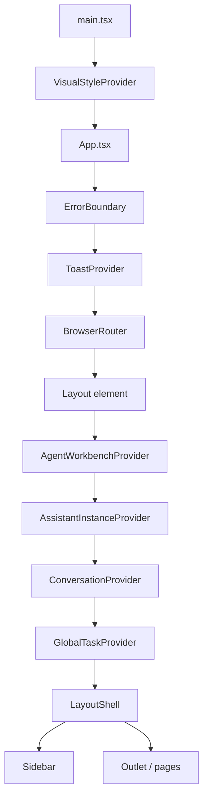

# 22 Layout Provider 树

## 覆盖模块

- `frontend/src/main.tsx`
- `frontend/src/App.tsx`
- `frontend/src/components/Layout.tsx`
- `frontend/src/contexts/AgentWorkbenchContext.tsx`
- `frontend/src/contexts/AssistantInstanceContext.tsx`
- `frontend/src/contexts/ConversationContext.tsx`
- `frontend/src/contexts/GlobalTaskContext.tsx`

## 图

## 阅读提示

- 这张图回答的是“页面到底被哪些 Provider 包着”。
- 如果你在查某个状态来自哪里，通常要先顺着这棵树找。
