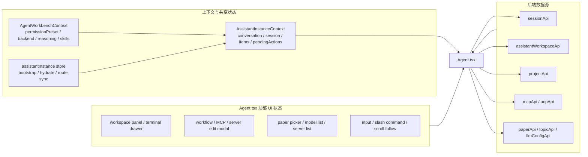

# 23 Agent 页面状态来源图

## 覆盖模块

- `frontend/src/pages/Agent.tsx`
- `frontend/src/contexts/AssistantInstanceContext.tsx`
- `frontend/src/contexts/AgentWorkbenchContext.tsx`
- `frontend/src/features/assistantInstance/store.ts`
- `frontend/src/services/api.ts`

## 图

## 阅读提示

- 读 `Agent.tsx` 时，先把状态分成上下文状态、页面局部状态、后端驱动状态三类。
- 最近变更最关键的是 store 会在没有 `workspacePath` 时停止自动 bootstrap。
