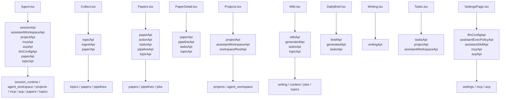

# 24 页面到 API 服务依赖图

## 覆盖模块

- `frontend/src/pages/*.tsx`
- `frontend/src/services/api.ts`
- `apps/api/routers/*.py`

## 图

## 阅读提示

- 这张图适合在“我想知道某个页面到底调用了哪些后端面”时使用。
- `Agent.tsx` 的服务依赖明显最重，说明它确实是主工作台。
