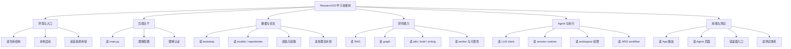

# 25 30 课技能树

## 覆盖模块

- 全部 30 课

## 图

```mermaid
flowchart TD
  Root[ResearchOS 学习技能树]
  Root --> S1[环境与入口]
  Root --> S2[后端主干]
  Root --> S3[数据与论文]
  Root --> S4[研究能力]
  Root --> S5[Agent 与执行]
  Root --> S6[前端与测试]

  S1 --> A1[读仓库结构]
  S1 --> A2[本地启动]
  S1 --> A3[追首条调用链]

  S2 --> B1[读 main.py]
  S2 --> B2[理解配置]
  S2 --> B3[理解认证]

  S3 --> C1[读 bootstrap]
  S3 --> C2[读 models / repositories]
  S3 --> C3[读输入链路]
  S3 --> C4[读处理流水线]

  S4 --> D1[读 RAG]
  S4 --> D2[读 graph]
  S4 --> D3[读 wiki / brief / writing]
  S4 --> D4[读 worker 与可靠性]

  S5 --> E1[读 LLM client]
  S5 --> E2[读 session runtime]
  S5 --> E3[读 workspace 权限]
  S5 --> E4[读 ARIS workflow]

  S6 --> F1[读 App 路由]
  S6 --> F2[读 Agent 页面]
  S6 --> F3[读桌面入口]
  S6 --> F4[读测试体系]
```

## 阅读提示

- 这张图回答的是“学完 30 课你到底获得了哪些能力”。
- 真正最难的分支通常是 `E2 -> E4 -> F2 -> F4`。
