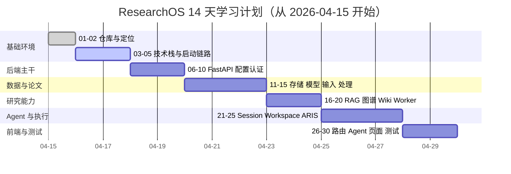

# 26 14 天学习计划甘特图

## 覆盖模块

- `class/lesson-01` 到 `class/lesson-30`

## 图

```mermaid
gantt
  title ResearchOS 14 天学习计划（从 2026-04-15 开始）
  dateFormat  YYYY-MM-DD
  axisFormat  %m-%d

  section 基础环境
  01-02 仓库与定位          :done,    a1, 2026-04-15, 1d
  03-05 技术栈与启动链路    :active,  a2, 2026-04-16, 2d

  section 后端主干
  06-10 FastAPI 配置认证    :         b1, 2026-04-18, 2d

  section 数据与论文
  11-15 存储 模型 输入 处理 :         c1, 2026-04-20, 3d

  section 研究能力
  16-20 RAG 图谱 Wiki Worker:         d1, 2026-04-23, 2d

  section Agent 与执行
  21-25 Session Workspace ARIS :      e1, 2026-04-25, 3d

  section 前端与测试
  26-30 路由 Agent 页面 测试 :        f1, 2026-04-28, 2d
```

## 阅读提示

- 这是压缩学习版计划，适合已经能跑起项目的读者。
- 如果你基础更弱，可以把每个 section 拆成 2 倍时长。
