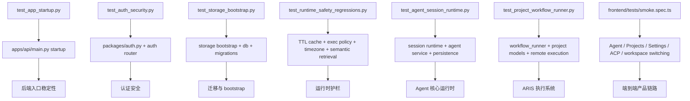

# 27 测试覆盖地图

## 覆盖模块

- `tests/test_app_startup.py`
- `tests/test_auth_security.py`
- `tests/test_storage_bootstrap.py`
- `tests/test_runtime_safety_regressions.py`
- `tests/test_agent_session_runtime.py`
- `tests/test_project_workflow_runner.py`
- `frontend/tests/smoke.spec.ts`

## 图

## 阅读提示

- 这张图适合在“我想知道作者到底在保护什么”时使用。
- 最近这轮提交最值得优先读的是 `Auth`、`Storage`、`RuntimeReg`、`Smoke` 四组测试。
