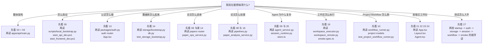

# 28 如何读代码导航图

## 覆盖模块

- 全仓库主要入口文件

## 图

```mermaid
flowchart TD
  Q[我现在最想搞清什么?]
  Q -->|整体架构| A[先看 03 + 04\n再读 apps/api/main.py]
  Q -->|怎么启动| B[先看 05\n再读 scripts/local_bootstrap.py\nstart_api_dev.ps1\nstart_frontend_dev.ps1]
  Q -->|认证怎么做| C[先看 13\n再读 packages/auth.py\nauth router\nApp.tsx]
  Q -->|数据库怎么起来| D[先看 14\n再读 storage/bootstrap.py\ndb.py\ntest_storage_bootstrap.py]
  Q -->|论文怎么进来| E[先看 08 与课 14\n再读 papers router\npaper_ops_service.py]
  Q -->|论文怎么处理| F[先看 08 与 16\n再读 pipelines.py\npaper_analysis_service.py]
  Q -->|Agent 为什么复杂| G[先看 09 与 20\n再读 agent_service.py\nsession_runtime.py\nstore.ts]
  Q -->|工作区怎么执行| H[先看 19\n再读 workspace_executor.py\nworkspace_remote.py\nsmoke.spec.ts]
  Q -->|Project Workflow 怎么跑| I[先看 10\n再读 workflow_runner.py\nproject models\ntest_project_workflow_runner.py]
  Q -->|前端主工作台| J[先看 21 22 23 24\n再读 App.tsx\nLayout.tsx\nAgent.tsx]
  Q -->|测试怎么入手| K[先看 27\n再按 startup -> auth -> storage -> session -> workflow -> smoke 的顺序读]
```

## 阅读提示

- 这张图解决的是“现在应该从哪一个文件开始读”的问题。
- 最容易读通的一条线通常是：`05 -> 11 -> 14 -> 08 -> 16 -> 27`。
