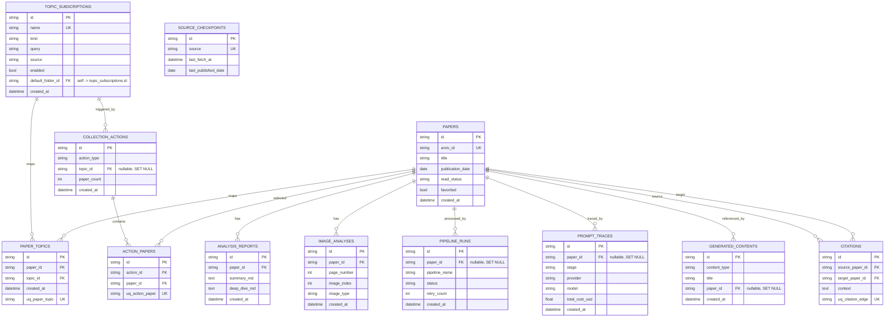
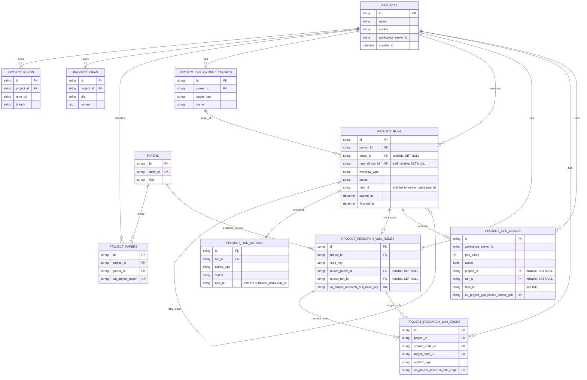
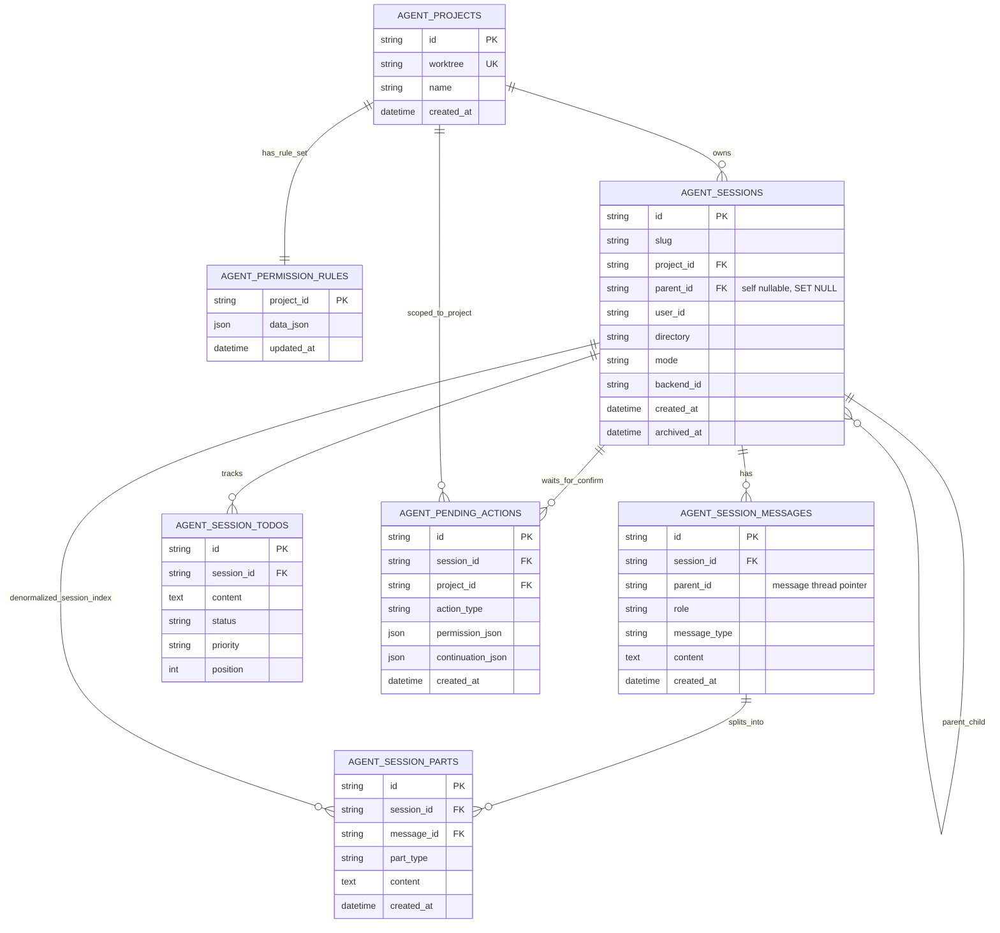
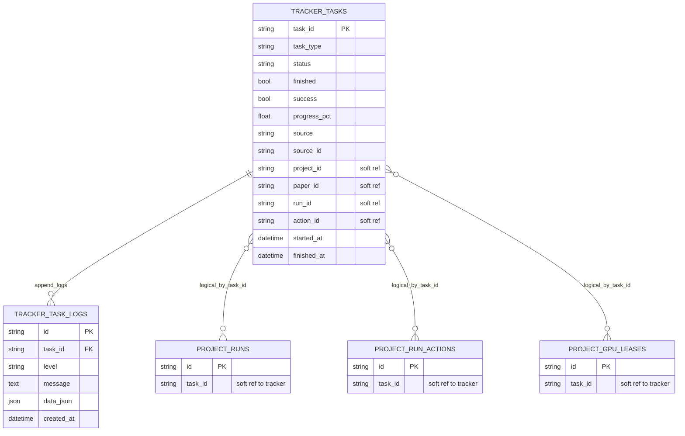

# 数据链路详图与查询手册

本文基于 `packages/storage/models.py` 当前模型定义整理，覆盖四条链路：
- Paper 数据链
- Project 工作流链
- Agent 会话链
- 任务追踪链

## 1. Paper 数据链

### 1.1 Mermaid 图



### 1.2 字段解释（核心）

- `papers`: 论文主表，`arxiv_id` 全局唯一，`read_status/favorited` 支撑阅读状态。
- `paper_topics`: 论文与主题多对多中间表，唯一约束 `uq_paper_topic` 防重复绑定。
- `pipeline_runs`: 处理流水，记录某篇论文跑过哪些 pipeline、状态如何。
- `analysis_reports`: 论文分析正文沉淀（摘要、深读）。
- `image_analyses`: 图表/公式级别分析结果。
- `citations`: 引用边（source -> target），`uq_citation_edge` 防重复边。
- `generated_contents`: 派生内容（wiki/brief/report），可回链到论文。
- `collection_actions` + `action_papers`: 一次收集动作与被纳入论文的关系。

### 1.3 查询示例 SQL

```sql
-- Q1: 某个 topic 最近 30 天纳入的论文（含基础状态）
SELECT p.id, p.title, p.arxiv_id, p.read_status, p.created_at
FROM paper_topics pt
JOIN papers p ON p.id = pt.paper_id
WHERE pt.topic_id = :topic_id
  AND p.created_at >= CURRENT_TIMESTAMP - INTERVAL '30 day'
ORDER BY p.created_at DESC;

-- Q2: 每篇论文最新一次 pipeline 状态
SELECT pr.paper_id, pr.pipeline_name, pr.status, pr.updated_at
FROM pipeline_runs pr
JOIN (
  SELECT paper_id, pipeline_name, MAX(updated_at) AS max_updated
  FROM pipeline_runs
  WHERE paper_id IS NOT NULL
  GROUP BY paper_id, pipeline_name
) t
  ON pr.paper_id = t.paper_id
 AND pr.pipeline_name = t.pipeline_name
 AND pr.updated_at = t.max_updated;

-- Q3: 某篇论文的引用出边和入边数量
SELECT p.id,
       SUM(CASE WHEN c.source_paper_id = p.id THEN 1 ELSE 0 END) AS out_citations,
       SUM(CASE WHEN c.target_paper_id = p.id THEN 1 ELSE 0 END) AS in_citations
FROM papers p
LEFT JOIN citations c
  ON c.source_paper_id = p.id OR c.target_paper_id = p.id
WHERE p.id = :paper_id
GROUP BY p.id;
```

## 2. Project 工作流链

### 2.1 Mermaid 图



### 2.2 字段解释（核心）

- `projects`: 项目主实体。
- `project_runs`: 项目 workflow 执行主线，`workflow_type/status` 定义运行态。
- `project_run_actions`: 针对某次 run 的后续动作（continue/retry 等）。
- `project_deployment_targets`: run 的部署目标。
- `project_papers`: 项目与论文关联表。
- `project_research_wiki_nodes/edges`: 项目知识图谱节点与边。
- `project_gpu_leases`: GPU 占用记录，与 project/run 关联。

### 2.3 查询示例 SQL

```sql
-- Q1: 某项目最近 20 次 run（附目标名称）
SELECT r.id, r.workflow_type, r.status, r.active_phase,
       r.started_at, r.finished_at,
       t.name AS target_name
FROM project_runs r
LEFT JOIN project_deployment_targets t ON t.id = r.target_id
WHERE r.project_id = :project_id
ORDER BY r.created_at DESC
LIMIT 20;

-- Q2: 某次 run 的动作链
SELECT a.id, a.action_type, a.status, a.active_phase, a.created_at
FROM project_run_actions a
WHERE a.run_id = :run_id
ORDER BY a.created_at ASC;

-- Q3: 某项目 wiki 图谱边（带两端节点 key）
SELECT e.id,
       sn.node_key AS source_key,
       tn.node_key AS target_key,
       e.relation_type,
       e.created_at
FROM project_research_wiki_edges e
JOIN project_research_wiki_nodes sn ON sn.id = e.source_node_id
JOIN project_research_wiki_nodes tn ON tn.id = e.target_node_id
WHERE e.project_id = :project_id
ORDER BY e.created_at DESC;

-- Q4: 当前活跃 GPU 占用
SELECT l.workspace_server_id, l.gpu_index, l.project_id, l.run_id, l.task_id, l.locked_at
FROM project_gpu_leases l
WHERE l.active = TRUE
ORDER BY l.workspace_server_id, l.gpu_index;
```

## 3. Agent 会话链

### 3.1 Mermaid 图



### 3.2 字段解释（核心）

- `agent_projects`: Agent 维度项目（`worktree` 唯一）。
- `agent_sessions`: 会话主表，支持 parent session 分叉。
- `agent_session_messages`: 顶层消息流。
- `agent_session_parts`: 消息分片（tool call、thinking、text 等结构化片段）。
- `agent_session_todos`: 会话内待办序列。
- `agent_permission_rules`: 项目级持久化权限规则。
- `agent_pending_actions`: 等待人工确认的动作。

### 3.3 查询示例 SQL

```sql
-- Q1: 某项目下最近活跃会话
SELECT s.id, s.slug, s.title, s.mode, s.updated_at
FROM agent_sessions s
WHERE s.project_id = :agent_project_id
  AND s.archived_at IS NULL
ORDER BY s.updated_at DESC
LIMIT 30;

-- Q2: 某会话最近 100 条消息（含 part 数量）
SELECT m.id, m.role, m.message_type, m.created_at,
       COUNT(p.id) AS part_count
FROM agent_session_messages m
LEFT JOIN agent_session_parts p ON p.message_id = m.id
WHERE m.session_id = :session_id
GROUP BY m.id, m.role, m.message_type, m.created_at
ORDER BY m.created_at DESC
LIMIT 100;

-- Q3: 待确认动作队列
SELECT pa.id, pa.action_type, pa.session_id, pa.project_id, pa.created_at
FROM agent_pending_actions pa
ORDER BY pa.created_at ASC;
```

## 4. 任务追踪链

### 4.1 Mermaid 图



### 4.2 字段解释（核心）

- `tracker_tasks`: 任务状态快照主表（进度、结果、错误、来源对象）。
- `tracker_task_logs`: append-friendly 日志明细表。
- 与 `project_runs/project_run_actions/project_gpu_leases` 通过 `task_id` 做逻辑关联（非 FK）。

### 4.3 查询示例 SQL

```sql
-- Q1: 最近失败任务
SELECT t.task_id, t.task_type, t.status, t.error, t.updated_at
FROM tracker_tasks t
WHERE t.success = FALSE OR t.status IN ('failed', 'error')
ORDER BY t.updated_at DESC
LIMIT 100;

-- Q2: 某任务日志时间线
SELECT l.created_at, l.level, l.message
FROM tracker_task_logs l
WHERE l.task_id = :task_id
ORDER BY l.created_at ASC;

-- Q3: 任务与项目 run 的关联检查（逻辑 join）
SELECT t.task_id, t.status, r.id AS run_id, r.workflow_type, r.status AS run_status
FROM tracker_tasks t
LEFT JOIN project_runs r ON r.task_id = t.task_id
WHERE t.task_id = :task_id;
```

## 5. 使用建议

- 若只做架构评审，优先看每节 `1.1/2.1/3.1/4.1` 图。
- 若做排障，先查 `tracker_tasks -> tracker_task_logs`，再按 `task_id` 回溯到 run/action。
- 若做数据治理，优先核查软关联字段一致性（`task_id/project_id/paper_id/run_id/action_id`）。
